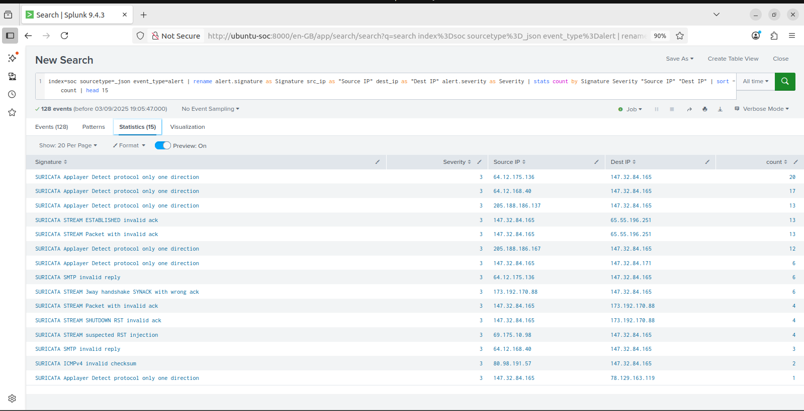
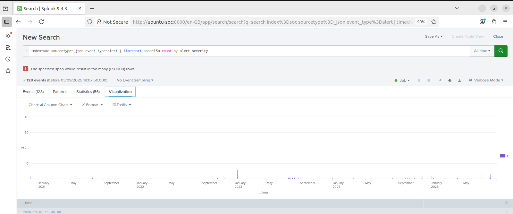
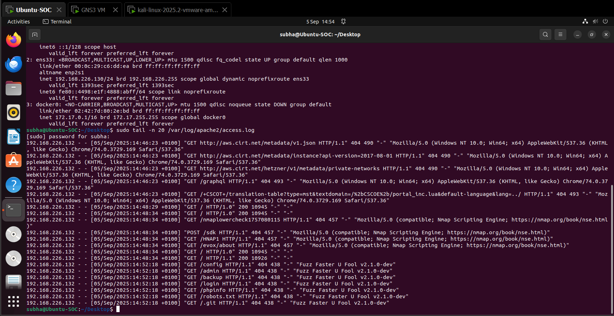

# SOC Lab — Threat Detection & Incident Response

A virtual Security Operations Centre built during my MSc Cybersecurity 
at the University of Southampton to simulate real-world attacks and 
practise detection, triage, and response.

## Lab Architecture

- **Ubuntu SOC VM** — Splunk SIEM + Snort IDS + ModSecurity WAF
- **Kali Linux VM** — attack machine
- All traffic routed internally to simulate a real network environment

## Attack Scenarios Simulated

| Attack Type | Tool Used | Detection Method |
|---|---|---|
| SQL Injection | SQLmap / Burp Suite | ModSecurity WAF + Splunk |
| Brute Force Login | Hydra | Snort IDS + Splunk alerts |
| XSS (Reflected) | Burp Suite | ModSecurity WAF |
| Port Scanning | nmap | Snort IDS |

## Tools & Technologies

- **Splunk SIEM** — log ingestion, custom dashboards, correlation rules
- **Snort IDS** — custom signatures to detect network-based attacks
- **ModSecurity WAF** — OWASP Top 10 rule set, HTTP payload blocking
- **Wireshark** — packet capture and traffic analysis
- **Burp Suite** — web application attack simulation

## Screenshots

### Splunk — Attack Statistics Table
Shows 128 events captured, filtered by signature, severity, source and destination IP.

### Splunk — Dashboard
Custom dashboard visualising alerts over time by severity.

### Apache Access Log — Brute Force Detection
Real-time log review capturing nmap scan and fuzzing attempts.

## Key Outcomes

- Detected all simulated attacks with zero missed alerts after tuning
- Built custom Splunk dashboards and correlation rules from scratch
- Wrote a full incident response playbook covering detection → triage → 
  containment → escalation
- Tuned Snort signatures to eliminate false positives in controlled testing

## Author

Subha Varsha Karuppannan  
MSc Cybersecurity — University of Southampton  
[LinkedIn](https://linkedin.com/in/subhavarsha-karuppannan)
